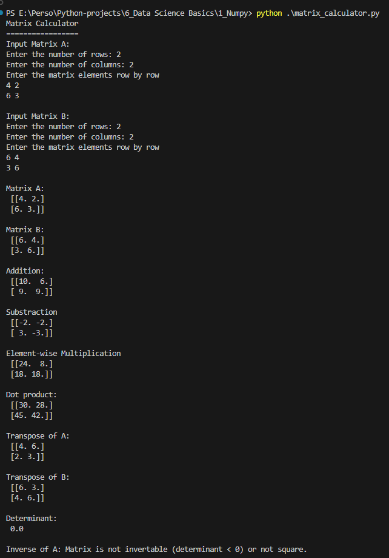
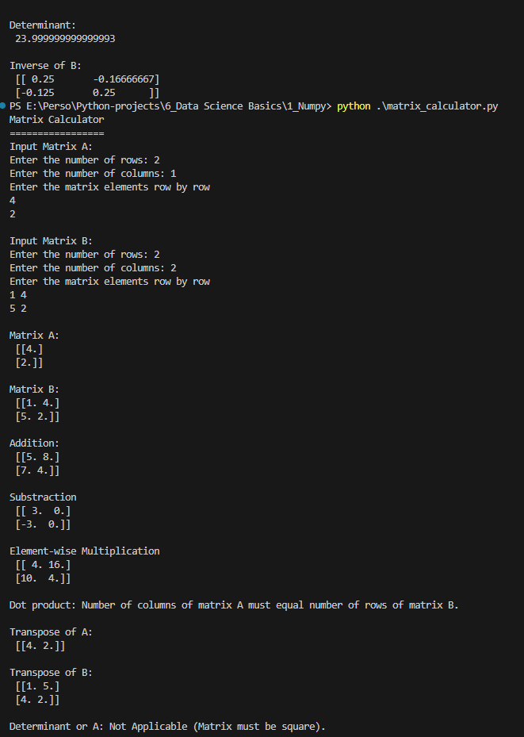
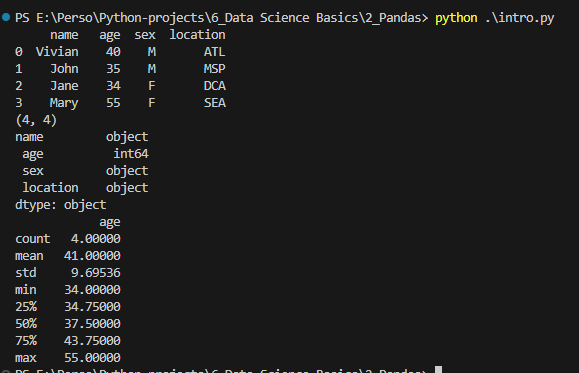
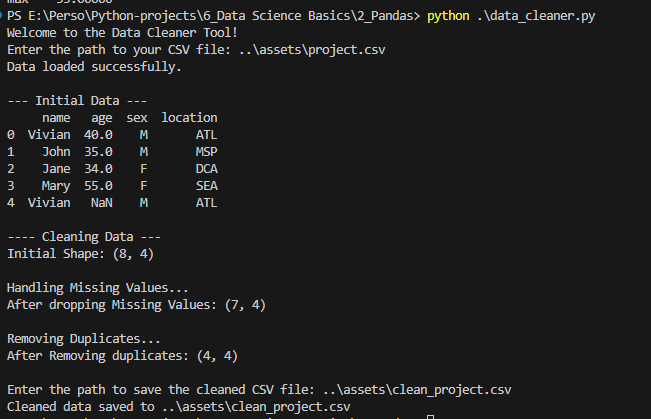

# Data Science Basics

## Numpy
*Notebook / Python files* : ./1_Numpy/*
*Related Files in assets folder* :

Matrices and operation on matrices. Quite a good lesson to recall Linear Algebra basics.

### Install Numpy
pip install numpy

### Project : Matrix Calculator

## Pandas
*Notebook / Python files* : ./2_Pandas/*
*Related Files in assets folder* : data.csv, data1.csv, clean_project.csv, project.csv

## Install Pandas
pip install pandas

# Intro on Pandas

### Project : Data Cleaner

# Bonus challenge:
- Add an option to fill NA values instead of dropping them
- Add an option to rename columns
- Include support for excel files

## Matplotlib
*Notebook / Python files* :
*Related Files in assets folder* :

### Project : Graph Plotter

## Data Analysis
*Notebook / Python files* :
*Related Files in assets folder* :

### Project : Sales Report Analyzer

## Plotting Trends
*Notebook / Python files* :
*Related Files in assets folder* :

### Project : Temperature Plotter

## Data Scraping
*Notebook / Python files* :
*Related Files in assets folder* :

### Stock Price Tracker

## Capstone project : COVID-19 Dashboard
*Notebook / Python files* :
*Related Files in assets folder* :

