# Data Science Basics

## Numpy
*Notebook / Python files* : ./1_Numpy/*
*Related Files in assets folder* :

Matrices and operation on matrices. Quite a good lesson to recall Linear Algebra basics.

### Install Numpy
pip install numpy

### Project : Matrix Calculator

#### Bonus challenge:
- Handle scalars and vector operations
- Add a graphical interface using Tkinter
- Integrate matrix saving loading to a file or from a file

## Pandas
*Notebook / Python files* : [./2_Pandas/](./2_Pandas/)
*Related Files in assets folder* : data.csv, data1.csv, clean_project.csv, project.csv

## Install Pandas
pip install pandas

# Intro on Pandas

### Project : Data Cleaner

# Bonus challenge:
- Add an option to fill NA values instead of dropping them
- Add an option to rename columns
- Include support for excel files

## Matplotlib
*Notebook / Python files* : [./3_Matplotlib/](./3_Matplotlib/)
*Related Files in assets folder* : [./assets/matplotlib/](./assets/matplotlib/)

### Install matplotlib
pip install matplotlib

### Basic Plots
#### Line graph
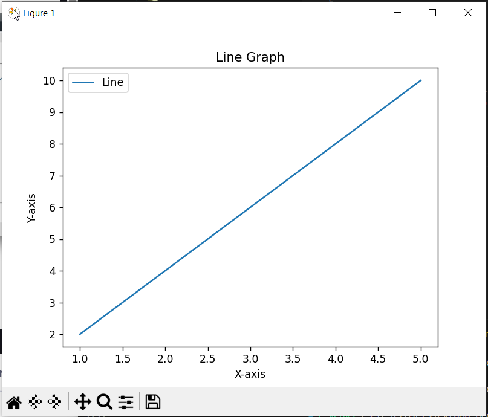

#### Bar chart
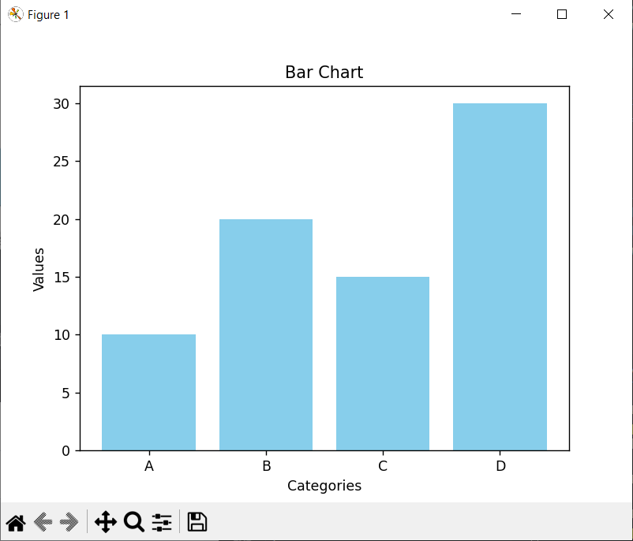

#### Scatter plot
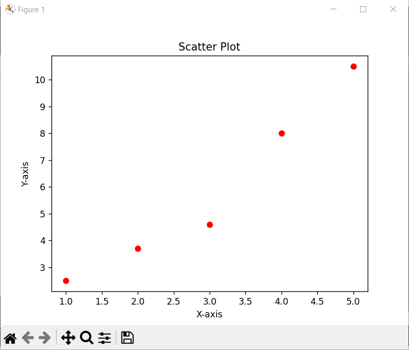

#### Personalized Graphs
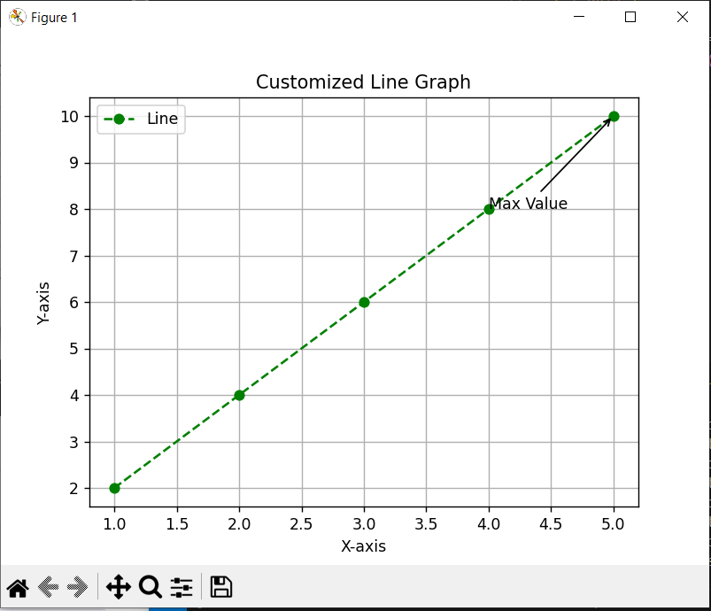

#### Subplots
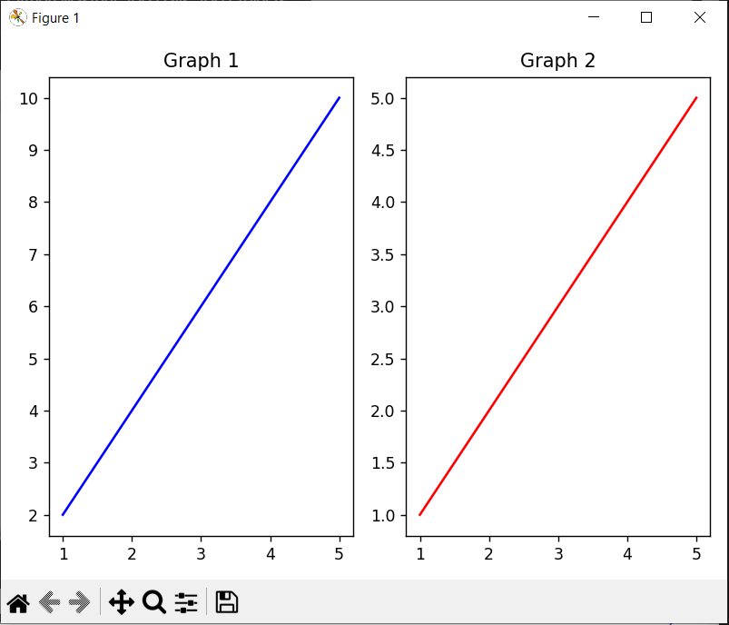

#### Plot from data files
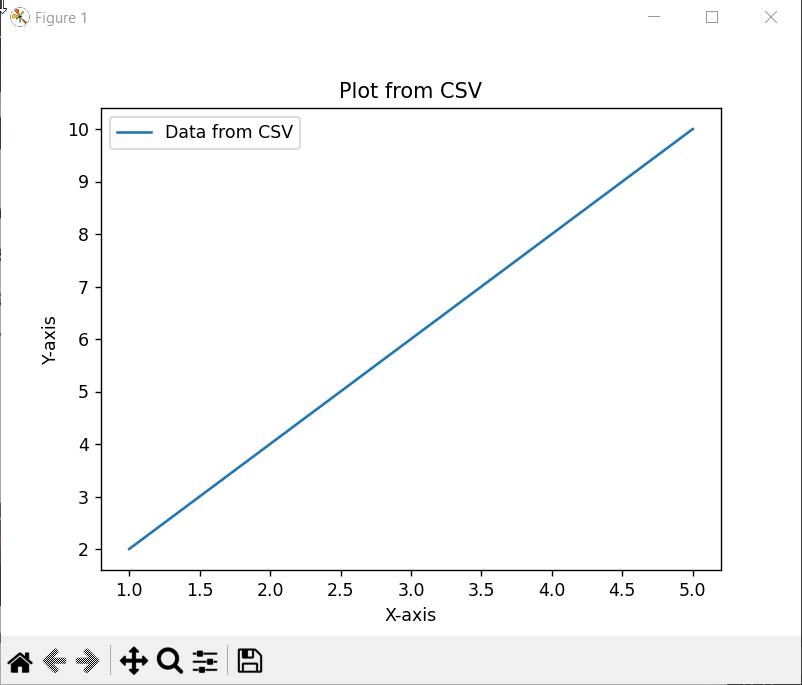

### Project : Graph Plotter
Build a CLI based graph plotter that accepts user input for data points or loads data from a file.
Plots graphs based on user selected types.
Save the generated graph as a file.

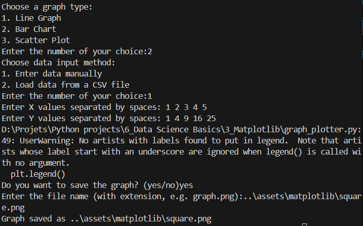
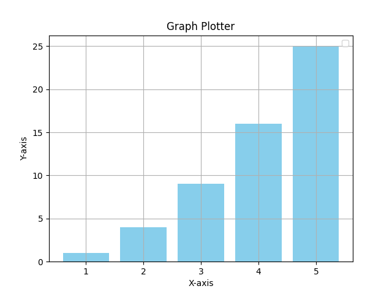
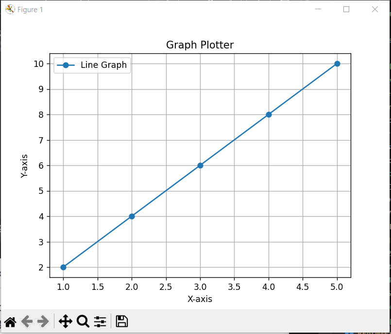

#### Bonus challenge (To be done)
Add more graph types
Implement Tkinter for interactive graph plotting

## Data Analysis
*Notebook / Python files* : [./4_Data_Analysis/](./4_Data_Analysis/)
*Related Files in assets folder* : [./assets/data_analysis/](./assets/data_analysis/)

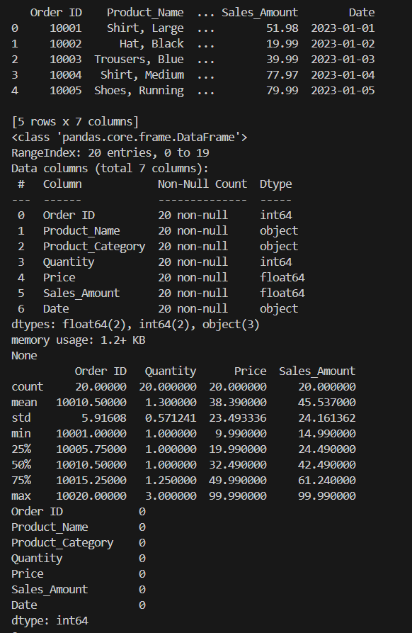
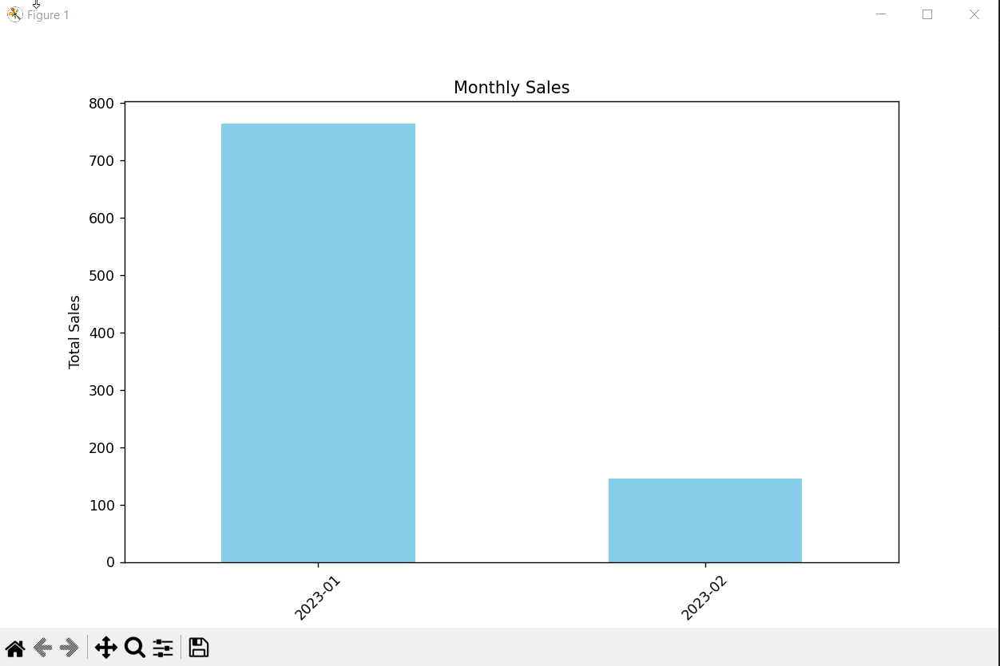

### Project : Sales Report Analyzer
Build a CLI based sales report analyzer that loads sales data from a CSV file, cleans and pre-processes.
The data, generates insights like top selling products, sales trends and revenue breakdowns, and visualizes key metrics.

#### Bonus Challenge :
- Ability to export the clean data in a CSV file
- Implement interactive filtering (e.g filter by category or date range)
- Implement advanced visualizations like pie charts or stacked bar plots

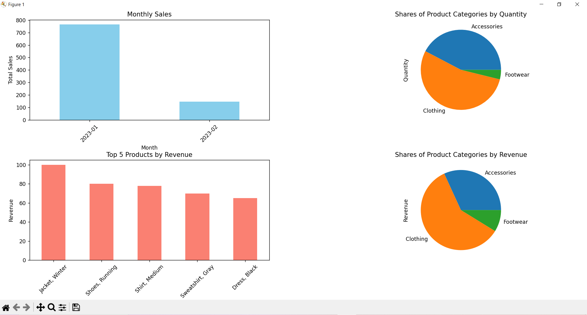

## Plotting Trends
*Notebook / Python files* : [./6_Data_Scraping/data_scraping.py](./6_Data_Scraping/data_scraping.py)
*Related Files in assets folder* : [./assets/plotting_trends/](./assets/plotting_trends/)

### Loading temperature data
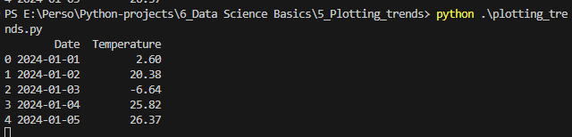

### Plot temperature trends
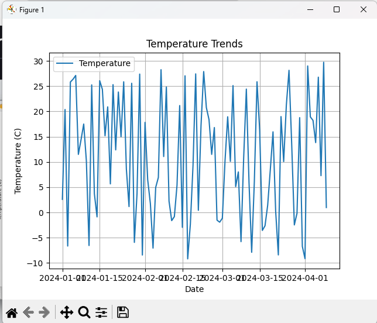
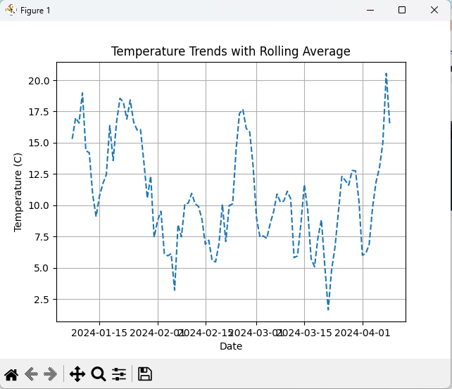

### Highlight Anomalies and Averages
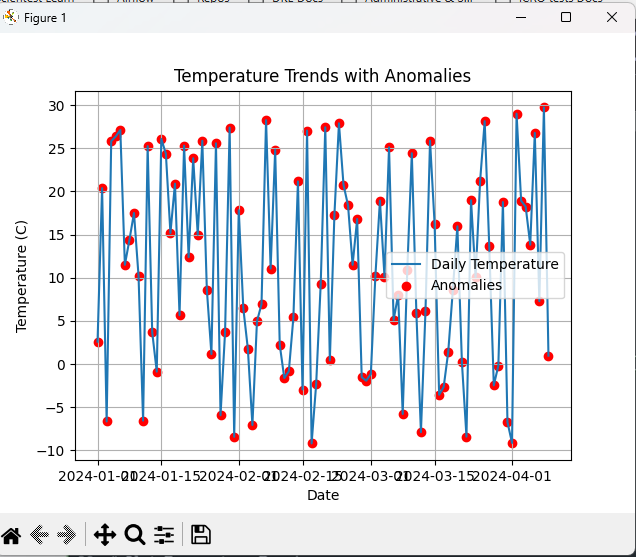

### Project : Temperature Plotter
- Load temperature data from a CSV file
- Plots the temperature trends with options for rolling averages and anomalies
- Save the customized plot as an image file

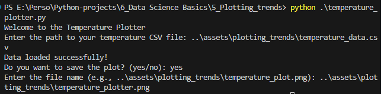
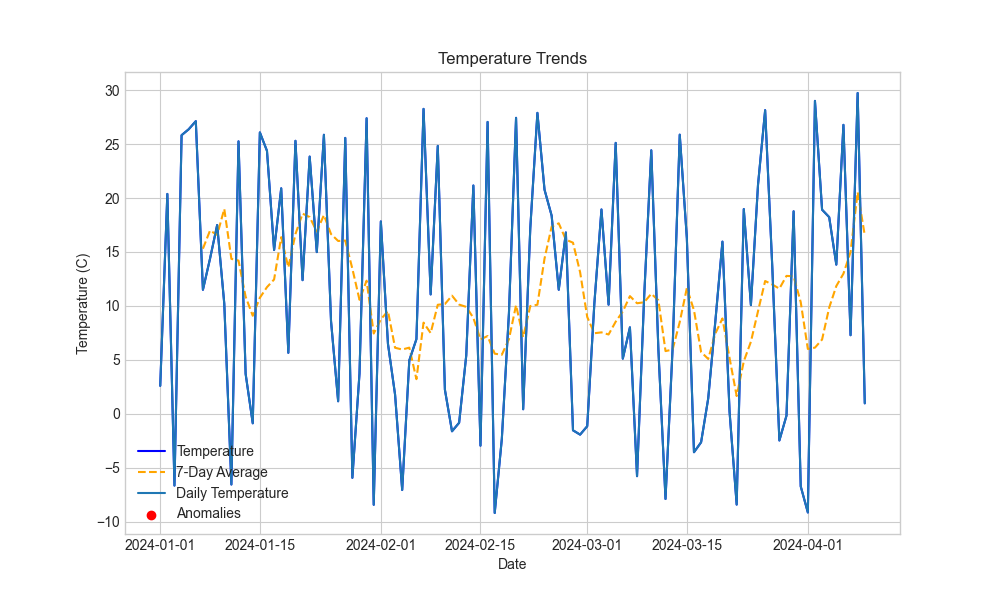

#### Bonus challenge
- Add options for monthly or yearly trend aggregation (Done) 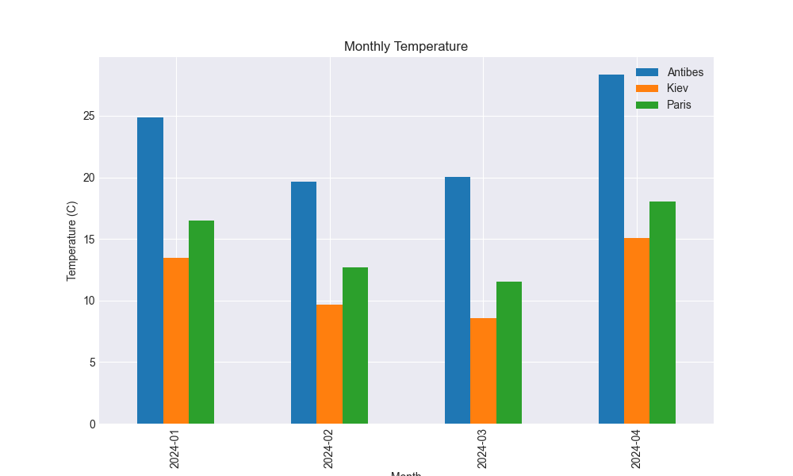, 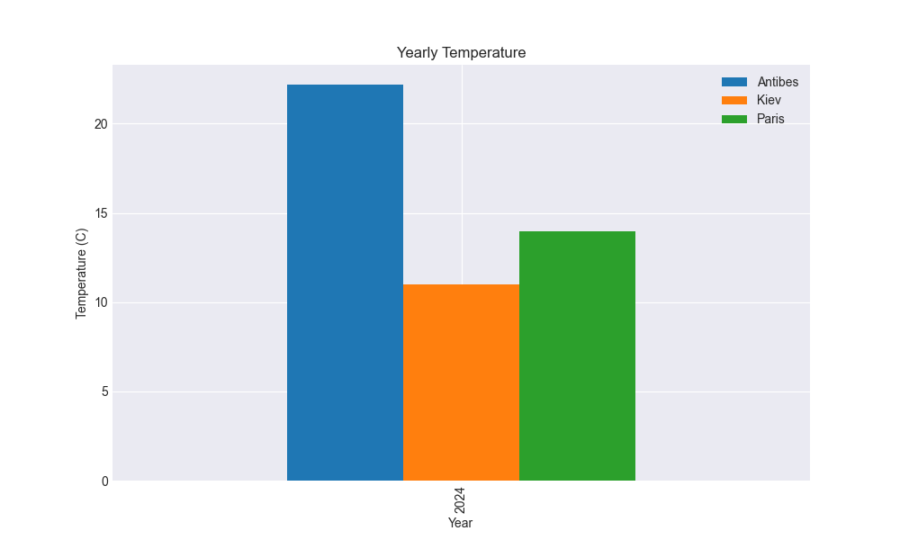
- Interactive visualisations with plotly (Not done)
- Try ot extend the tool to handle multiple city temperatures (Done) : dataset 

## Data Scraping
*Notebook / Python files* : [./6_Data_Scraping/](./6_Data_Scraping/)
*Related Files in assets folder* : [./assets/data_scraping/](./assets/data_scraping/)

pip install requests beautifulsoup4

### Stock Price Tracker
I faced the same issue as following the lesson along. The targeted URL always responds 429.
Two solutions: 
- Add headers (was not instructed)
- Use the library yfinance as yf (but it's not data scraping)

Okay now it's working fine with proper headers. Now I'm facing cookies. You might find html files in assets folder for debugging.
Some searches propose solution that I adopted : 
- Accept the cookie form
- Go to Developer tools
- Retrieve Cookie value in Network

#### Project : Stock Price Tracker
Same content as in the course

##### Bonus challenge:
- Add support for tracking multiple stock symbols simultaneously
- Organize them in a pretty format
- Save tracked stock prices in a file 
- Build a Tkinter GUI

## Capstone project : COVID-19 Dashboard
*Notebook / Python files* :
*Related Files in assets folder* :

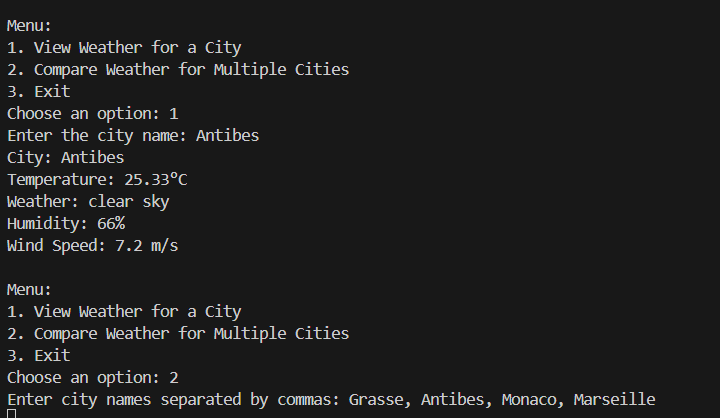
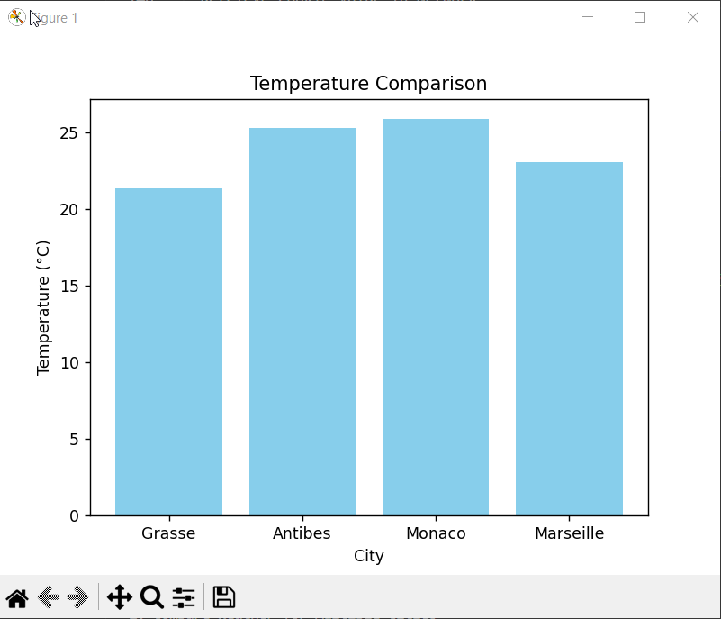

### Bonus challenge
- Add weekly weather forecast (done)
- Interactive maps for weather visualization with Plotly (done)
- Build a GUI (not done)
