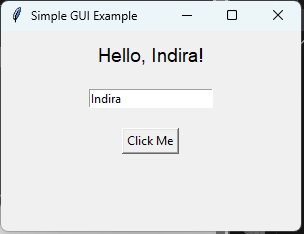
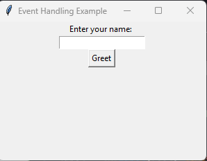
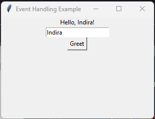
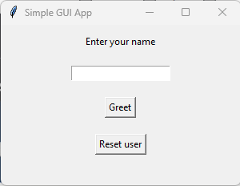
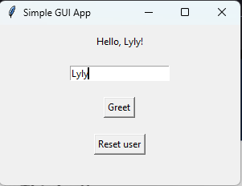

# GUI Programming

## TKinter App
I discover tkinter library which I never used. For this first lesson, I browse basics of creating a window, adding widgets and handling user events.

### Adding Widgets

### User event handling

### Simple GUI App
The project was mainly about what has been done in the lesson (cf notebook). The principal challenge was to perform the code without watching the video along - simple like ABC I would say! 

My attempt (following images) was quite simple compared to the proposed solution. 

The proposed solution included a method to configure the window background which was not in the lesson. It is a way better than what I actually pictured in the beginning.

