# GUI Programming

## TKinter App
I discover tkinter library which I never used. For this first lesson, I browse basics of creating a window, adding widgets and handling user events.

### Adding Widgets
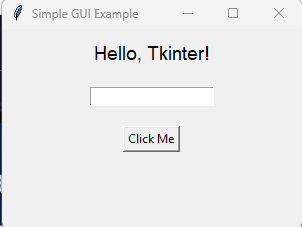
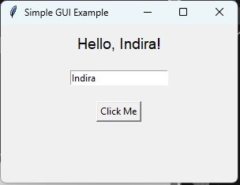

### User event handling
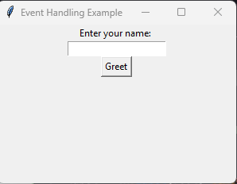
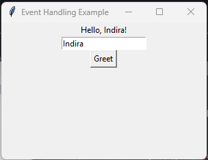

### Simple GUI App
The project was mainly about what has been done in the lesson (cf notebook). The principal challenge was to perform the code without watching the video along - simple like ABC I would say! 

My attempt (following images) was quite simple compared to the proposed solution. 

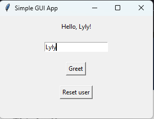

The proposed solution included a method to configure the window background which was not in the lesson. It is a way better than what I actually pictured in the beginning.

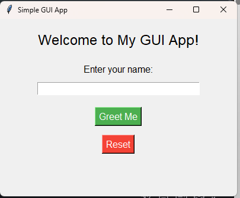
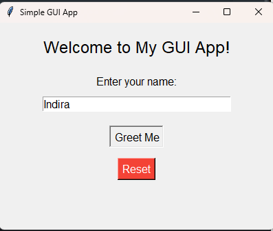
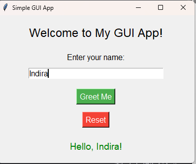
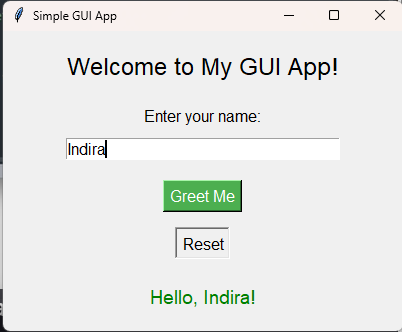
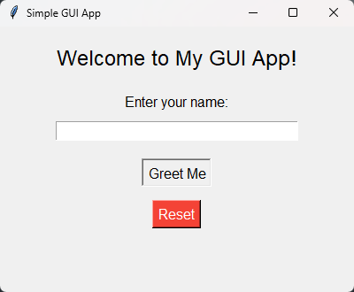
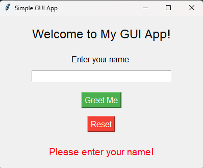

The bonus challenge consisted into adding a dropdown menu to greet with a specific language.
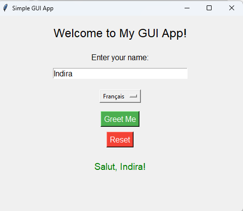
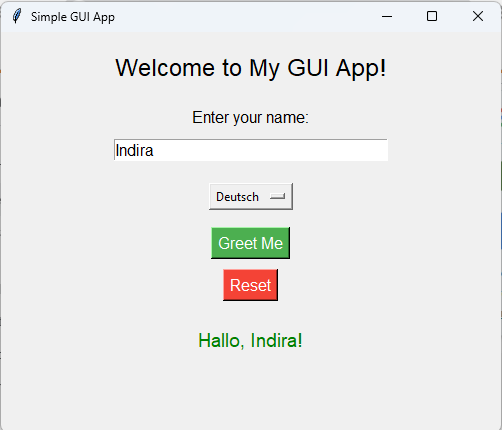
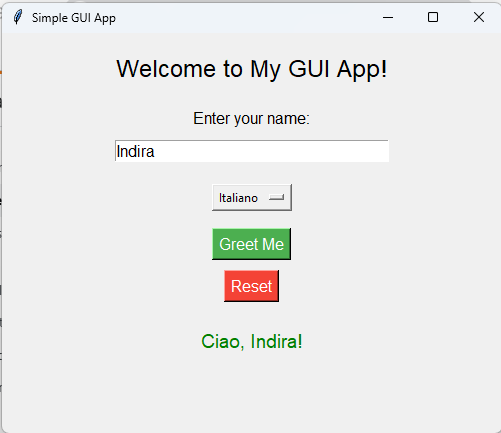

## Buttons and Events
Another move on GUI Programming. Going deep on Tkinter buttons was an interesting challenge.
For the bonus challenge, I used a file to save the highest value reached in the application (a good mean to practice what has been learned before).

### How buttons work
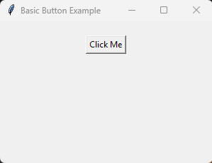
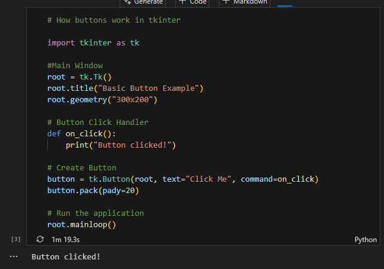

### Event Handlers
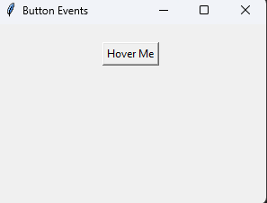
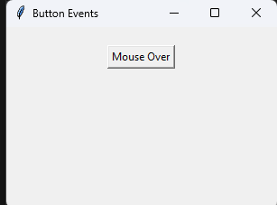
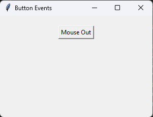

### Dynamic updates
#### On labels
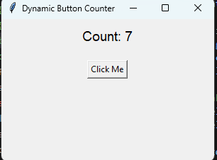
#### On other buttons
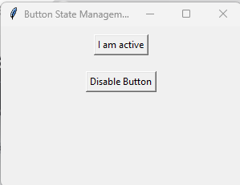
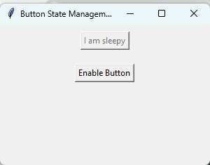

### Project Click Counter App
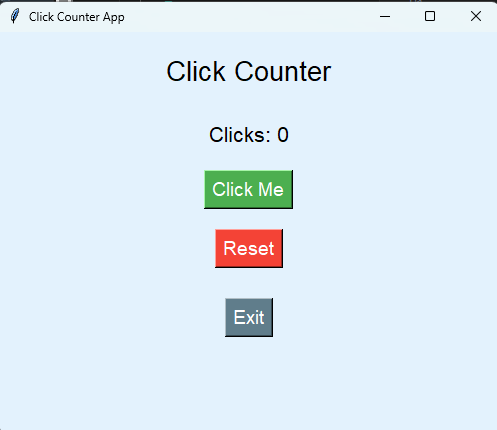
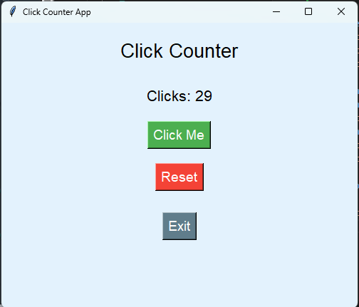

#### Bonus part
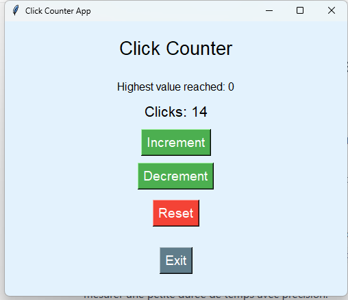
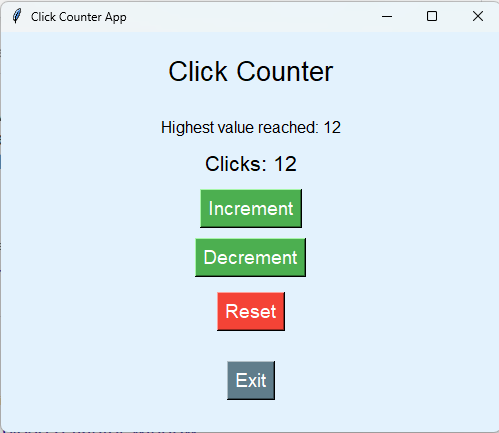
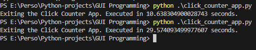