# GUI Programming

## TKinter App
*Notebook and Python files* : simple_app_gui_tkinter.ipynb, simple_gui.py
*Related Files in assets folder* : 
I discover tkinter library which I never used. For this first lesson, I browse basics of creating a window, adding widgets and handling user events.

### Adding Widgets

### User event handling

### Simple GUI App
The project was mainly about what has been done in the lesson (cf notebook). The principal challenge was to perform the code without watching the video along - simple like ABC I would say! 

My attempt (following images) was quite simple compared to the proposed solution. 

The proposed solution included a method to configure the window background which was not in the lesson. It is a way better than what I actually pictured in the beginning.

The bonus challenge consisted into adding a dropdown menu to greet with a specific language.

## Buttons and Events
*Notebook and Python files* : button_events.ipynb, click_counter_app.py
*Related Files in assets folder* : highest_counter.txt
Another move on GUI Programming. Going deep on Tkinter buttons was an interesting challenge.
For the bonus challenge, I used a file to save the highest value reached in the application (a good mean to practice what has been learned before).

### How buttons work

### Event Handlers

### Dynamic updates
#### On labels

#### On other buttons

### Project Click Counter App

#### Bonus part

## Input fields
*Notebook and Python files* : input_fields.ipynb, bmi_calculator.py
*Related Files in assets folder* : bmi_history_file.csv
Phew! another step here! Really not sure I am the GUI-type, but what can't we do for the sake of learning, eh?
Input fields have already been introduced before. I was pleased to discover how lambda functions can be used in command for widgets, I'm curious about practicing it in the following projects.
You have quite a photo book to watch here, especially for the BMI Calculator project. Please forgive me for the inaccuracies of conversions.

### Basics
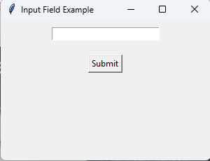
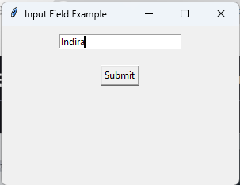
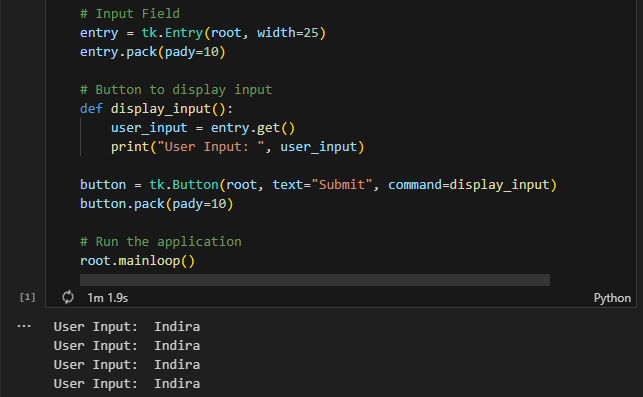

### Validate input
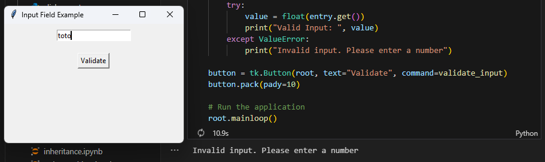

### Dynamic updates
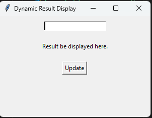
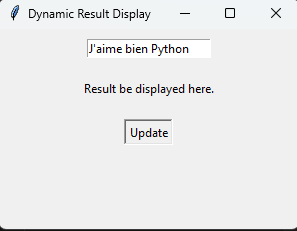
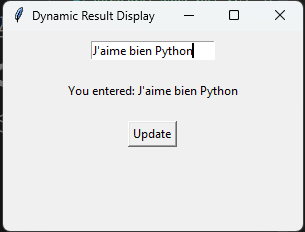

### Project : BMI Calculator
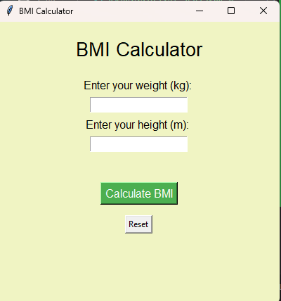
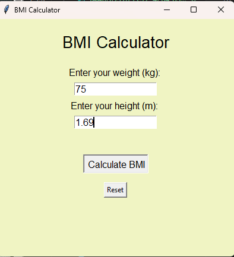
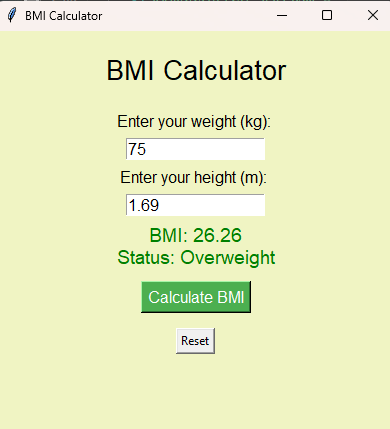
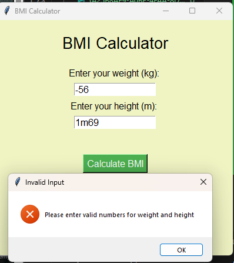

#### Bonus challenge
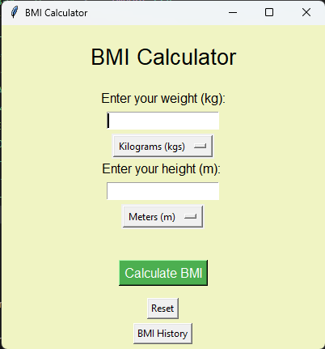
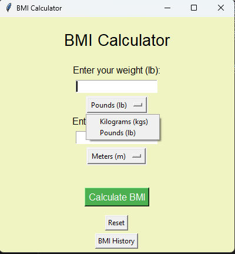

## Canvas widgets
*Notebook and Python files* : input_canvas_widgets.ipynb, drawing_pad_app.py
*Related Files in assets folder* : First_image.png, "Second image.png"
Mummy ! Daddy! I developed Paint! Ah ah! It was funny working with canvas widgets. Things are getting tougher and tougher. I can anticipate the usage of this widget in handwriting recognition.
I struggled a bit on the bonus challenge of the project but it was overall enriching. I performed some researches on how to perform undo/redo actions as they are not built-in features.
Besides, I discovered:
- tk.Frame which provides a grid to organise buttons,
- filedialog which helps interaction with File Explorer

### Drawing Shapes and Lines
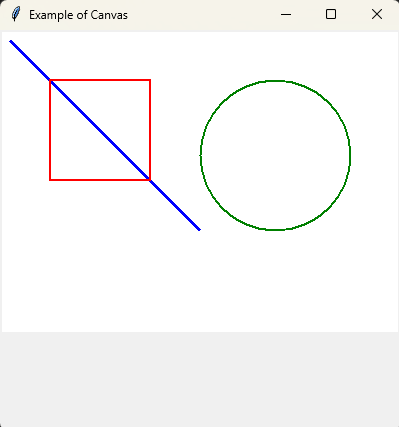

### Mouse events
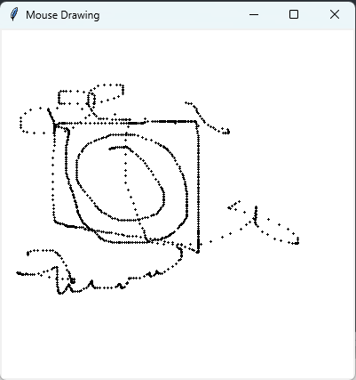

### Clear and resetting canvas
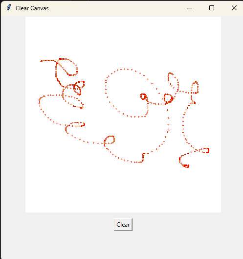
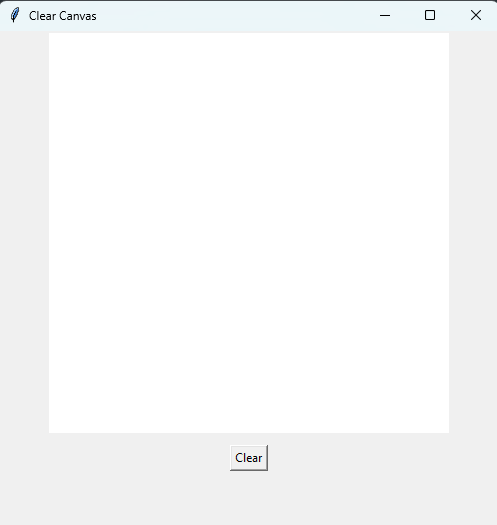

### Drawing padd app
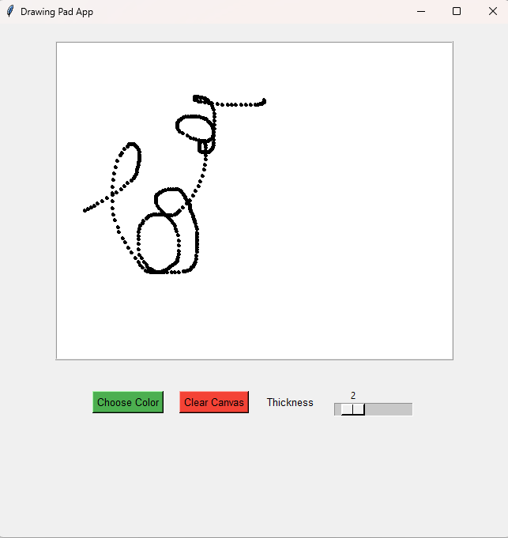
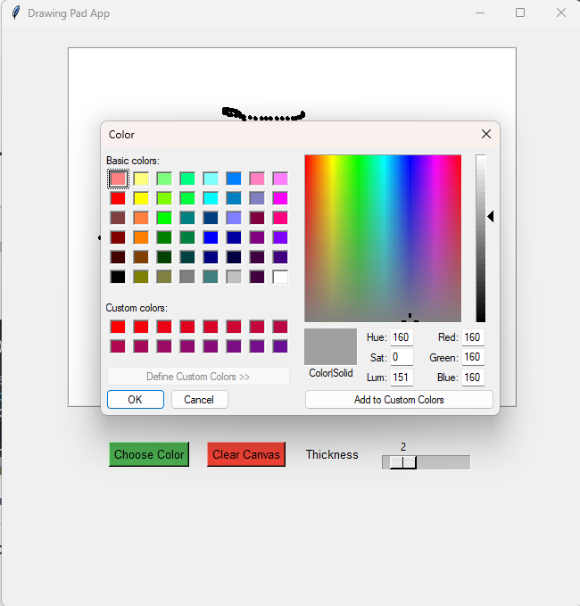
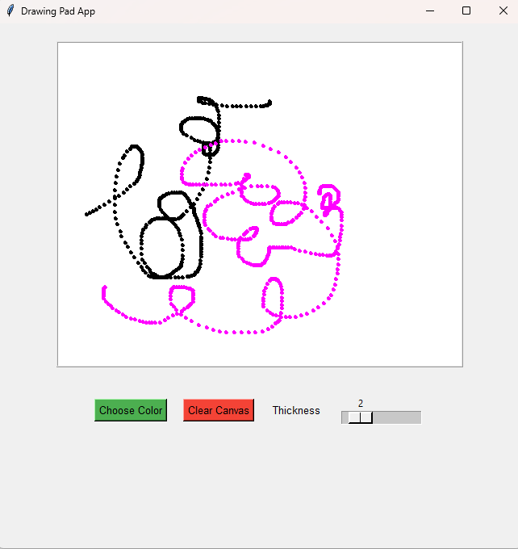
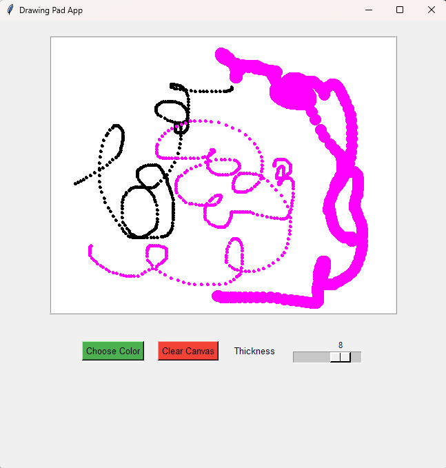

## Message boxes
*Notebook and Python files* : messages_box.ipynb, simple_login_system.py
*Related Files in assets folder* : user_file.json
Quite a simple lesson, yet interesting one! Moving from print statements reporting errors and warnings to message boxes which tell the user the state of their requests. Am I about to like GUI Programming ?

### Message box types
Info
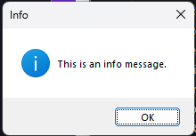

Warning

Error
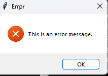

Yes/No
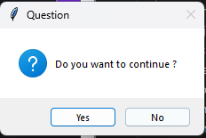

### Message box for user input validation
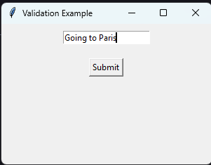
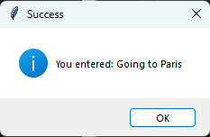
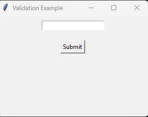

### Message box for user authentication
Incorrect username/password
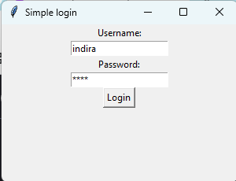
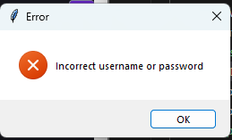

Correct credentials
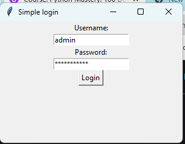
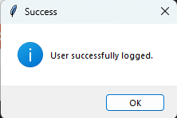

### Project : Simple login system
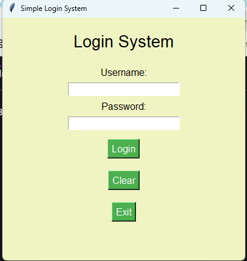
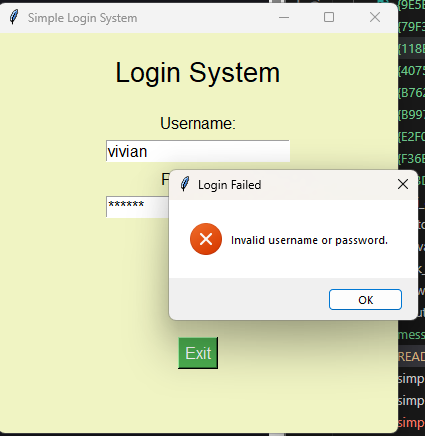
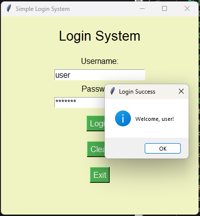
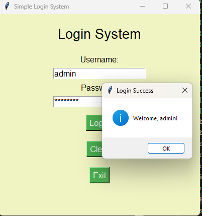

#### Bonus challenge
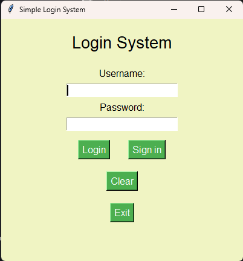
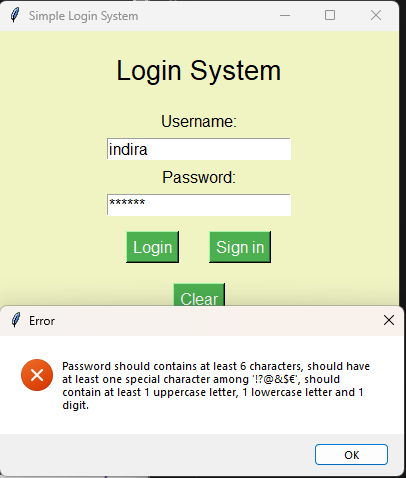
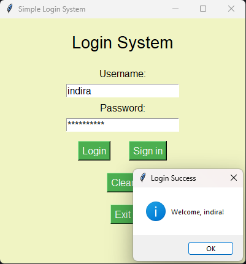
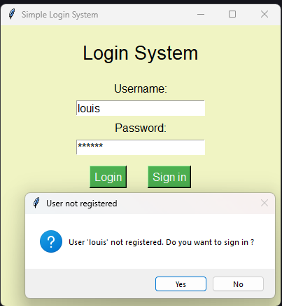