# Web Developmen with Python

## Flask Basics
*Notebook / Python files* : ./1_Flask_Basics/*
*Related Files in assets folder* :
Well! Every house needs strong foundation to remain. Let's start by defining the templates and how Flask uses it for page layout.

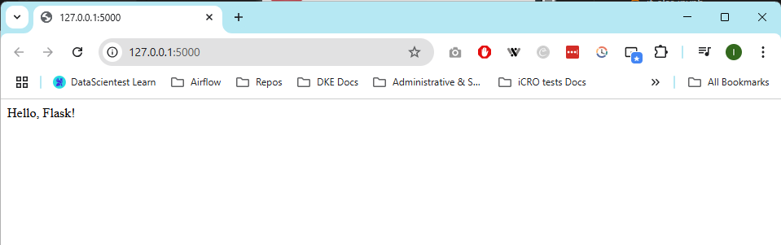
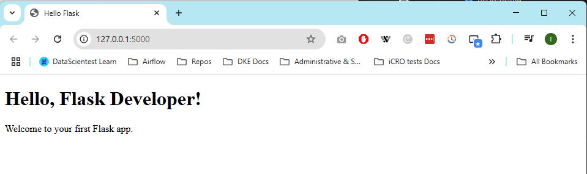

### Project :
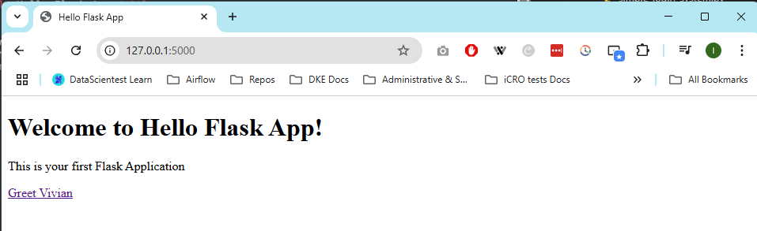
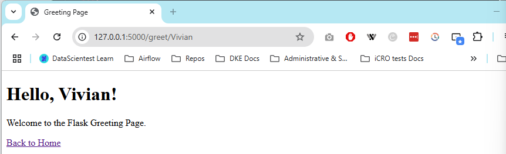
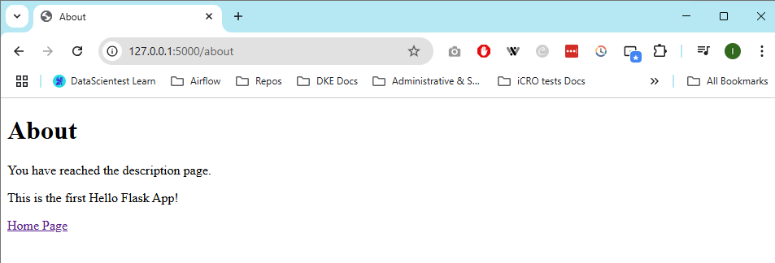

#### Bonus challenge :
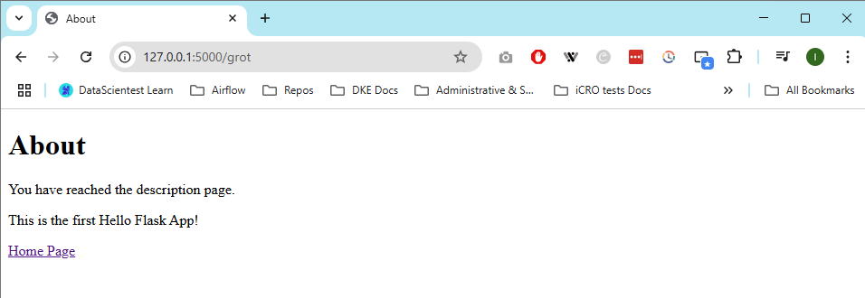

## Routes & Templates
*Notebook / Python files* : ./2_routes_templates
*Related Files in assets folder* :

Well! What a marvelous lesson! The idea of building my own Python challenge blog grew in my mind. Can't wait for next projects.

### Advanced Flask Routing
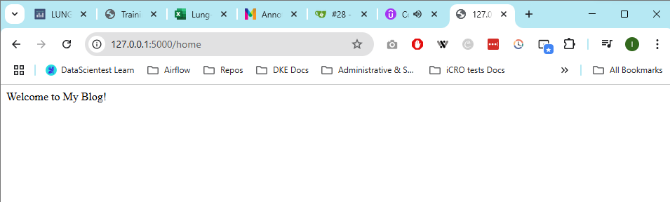
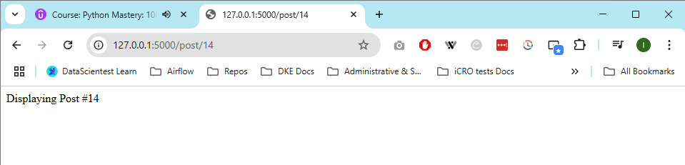

### Dynamic Templates Jinja2
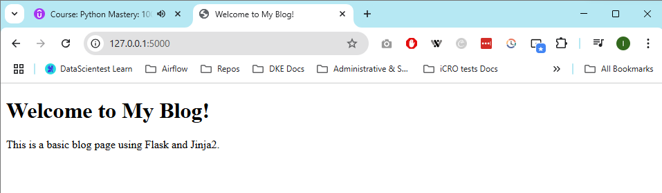

### Passing Data
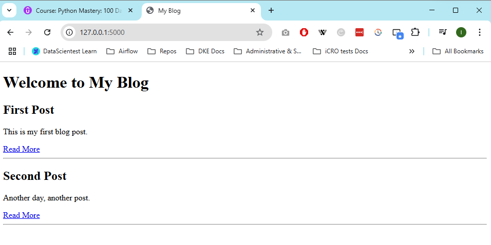

### Project
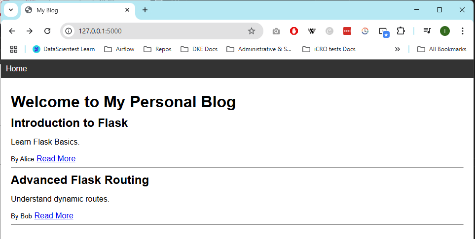
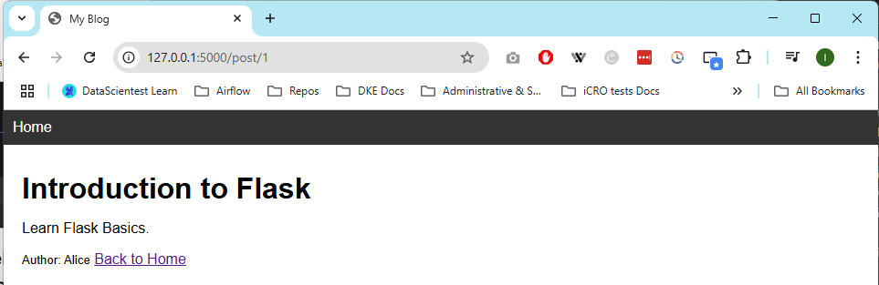
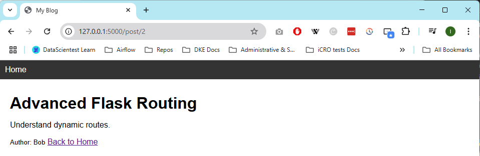

## Forms & User Input
*Notebook / Python files* : ./3_forms_user_input
*Related Files in assets folder* :

A huge step in using Flask. I wasn't aware about a built-in library that will validate user input. A pleasant surprise, but I still need to practice to fully understand this feature.

### Projects
Needed to install email_validator to work without any bug: pip install email_validator

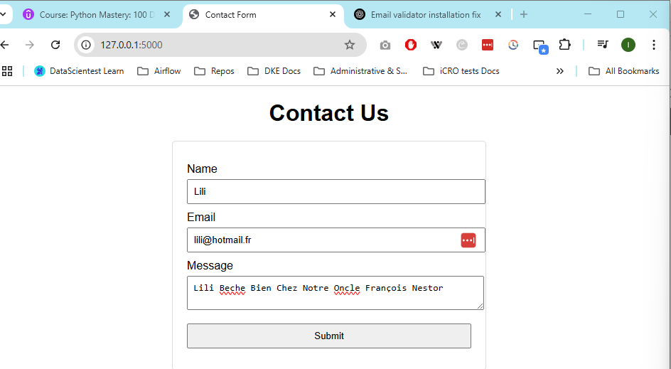
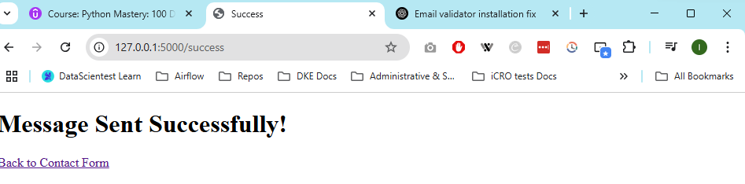
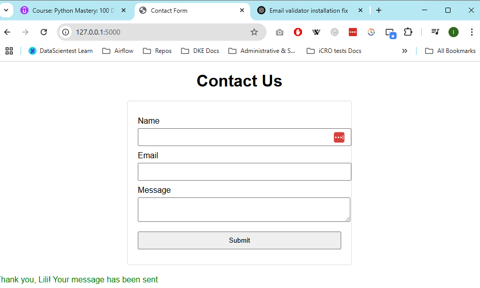

### Install Flask WTF
pip install flask-wtf
pip show flask-wtf

## Database Integration
*Notebook / Python files* : ./4_database_integration
*Related Files in assets folder* :

### Install Flask-SQLAlchemy
pip install flask-sqlalchemy

### Projects
Goal : Basic user registration without login module or any verification after login. A user should not be registered twice.

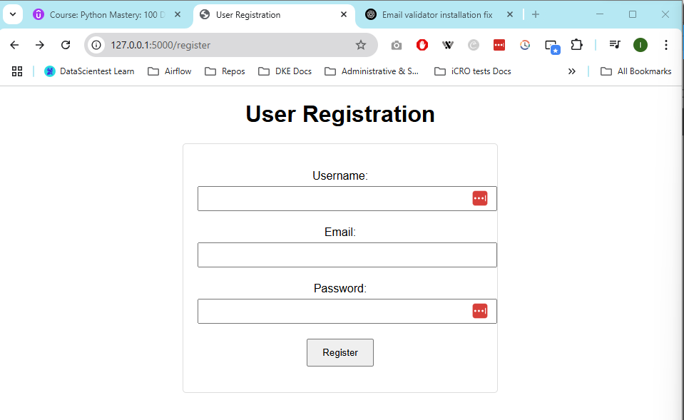
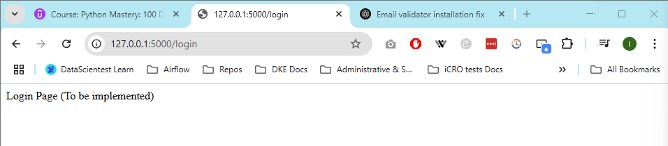
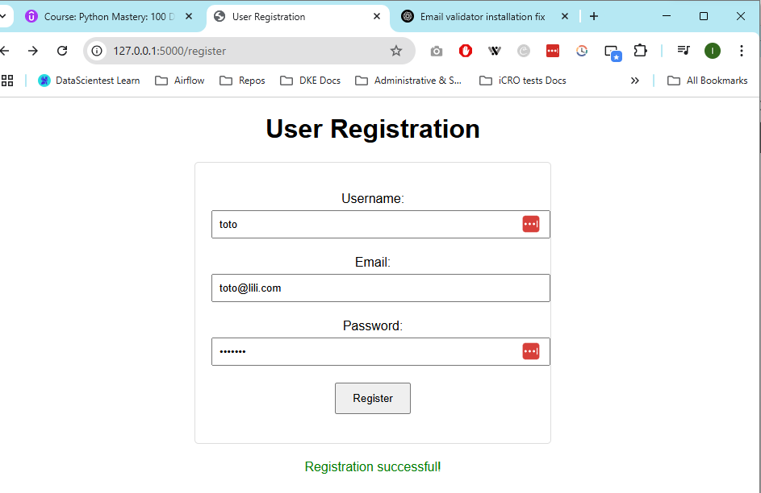

Bonus challenge: Implement login page + user login verification

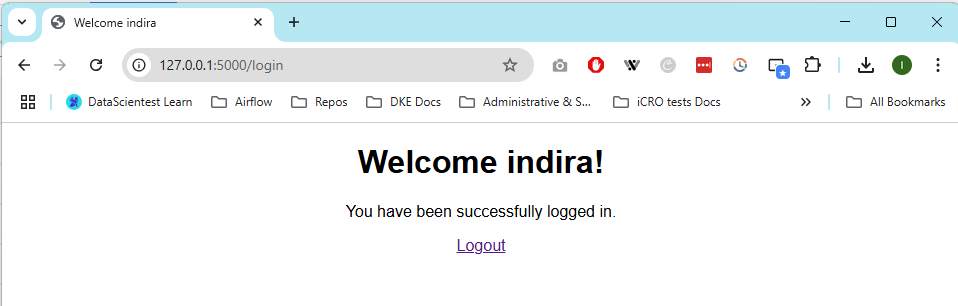

## REST APIs
*Notebook / Python files* :
*Related Files in assets folder* :

## Deployment
*Notebook / Python files* :
*Related Files in assets folder* :

## Flask Capstone
*Notebook / Python files* :
*Related Files in assets folder* :